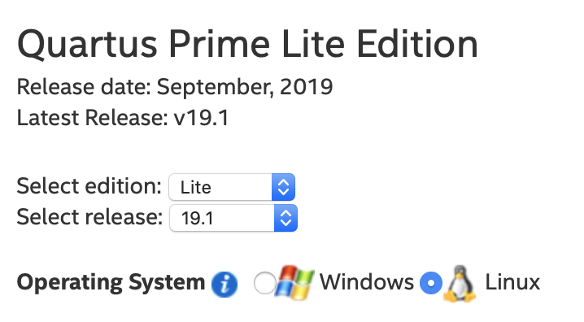
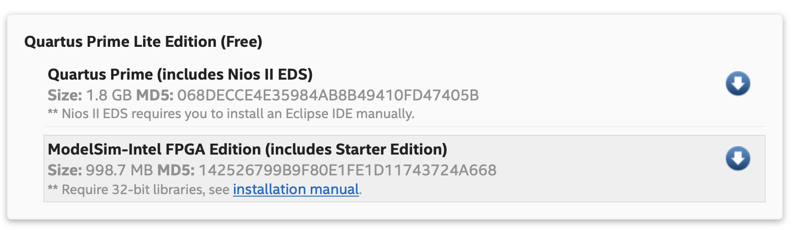

# jprx modelsim_docker
Dockerfile and libraries necessary for running ModelSim (Quartus 19.1 Lite Edition) on Linux or Mac, as well as a patcher for Modelsim's `linux_rh60` bug.

This repo contains a Dockerfile that allows you to setup & run Modelsim. It contains a patch for the `linux_rh60` bug in Modelsim, as
well as the specific deb packages for ```libfreetype``` and ```libpng``` required by Modelsim to run.

# Setup
Not included in this repo is the modelsim installer file. This file can be downloaded from Intel at:
https://fpgasoftware.intel.com/19.1/?edition=lite&product=modelsim_ae&platform=linux#tabs-2

The version of Modelsim that this Dockerfile supports is the version of Modelsim-ASE that ships with Quartus Prime 19.1 Lite.



When downloading the Modelsim installer, make sure to chose the Linux version (even if you are on Mac).



The downloaded file should be renamed to `modelsim_setup.run` and placed in the same folder as the Dockerfile.

# Running It
## Linux
Execute `./build.sh` to build the container, and `./start.sh` to run it.

When launched with `./start.sh`, the Docker container will run with the executing user's UID and GID, allowing for direct
connection to X11 through `/tmp/.X11-unix`. The user's home directory is also mounted in the container as RW, allowing for
easy access to files from Modelsim.

## Mac
Execute `./build.sh` to build the container.

The Mac version of `modelsim_docker` requires `XQuartz`, which can be installed with `brew cask install xquartz`.

First, launch XQuartz and then go to ZQuartz -> Preferences -> Security and check Allow remote connections. Restart XQuartz.

To make a directory from your Mac visible to `Modelsim`, specify the Mac directory to mount in `mac_start.sh`'s variable "MAC_DIR". This directory will be mounted at /mac/ in the container.

Before attempting to run the container, ensure `Docker` is running!

Then, run `./mac_start.sh` to start the container and you should see the `Modelsim` window open.

When you are done running Modelsim, if you are security conscious, you should run `./mac_stop.sh` to disallow remote X11 connections, uncheck 'Allow remote connections' under XQuartz Preferences, and quit XQuartz. Every time you run Modelsim you will need to ensure 'Allow remote connections' is checked though.
